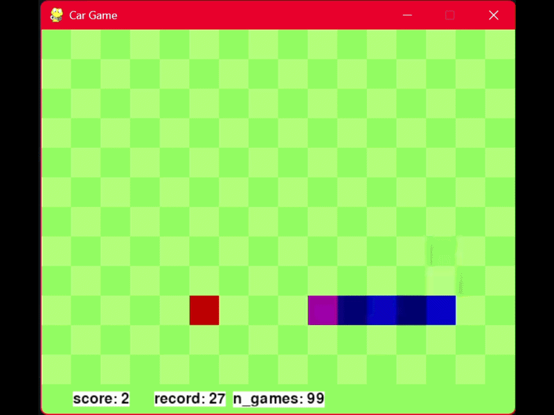

# DeepRL-Snake-Game
Simple python snake game with deep reinforcement learning solver. Created using PyGame, PyTorch and Patrick Loeber's deep reinforcement learning implementation: https://github.com/patrickloeber/snake-ai-pytorch.

# Demo Video:
<p align="center">
  
</p>

# Features:
## PyGame:
- snake game
- get apples without going out of bounds or colliding with your own body
- controls: 'w' for up, 's' for down, 'a' for left, 'd' for right
- note: opposite direction controls are not allowed e.g: if travelling up, 's' to go down is not allowed in the code
## Deep Reinforcement Learning Solver:
- reinforcement learning navigator using deep neural network
- simulates a replica environment
- rewards: -10 for going out of bounds, crashing into player body or not eating the apple after set amount of moves, +10 for eating the apple
- repitition move limit before automatic gameover: 192 (rows * cols)
- learning rate: 0.001
- gamma: 0.9
- epsilon: 80 - n_games (n_games = number of games/generations)

# Quick Start:
1. Install dependencies:
```
pip install numpy
pip install matplotlib
pip install torch
pip install pygame
```
2. run game.py and enjoy

# Additional Notes:
I did not create nor design the deep reinforcement learning implementation. It was taken from Patrick Loeber's reinforcement learning with snake AI github/video and modified to work with my version of snake game.

Snake game was created by me using PyGame.